# 🎵 Spodify — The High-Fidelity Music Experience for Android

[](https://github.com/xauravww/spodify-releases/releases/latest)
[](https://github.com/xauravww/spodify-releases/releases)
[](#-100-free-policy--scam-warning)
[-brightgreen?style=for-the-badge)](#-security--virustotal-verification)
[](https://github.com/xauravww/spodify-releases/releases/latest)
[](#-why-is-the-source-repository-private)

Spodify is an advanced, privacy-first Android music streaming client built with native performance. It delivers true **Studio Master 320 kbps** audio fidelity, multi-partner streaming failover, hardware DSP frequency tuning, real-time synchronized karaoke lyrics, interactive lockscreen controls, and a built-in auto-updater — completely free of ads, subscriptions, and telemetry.

---

## 📥 Download Spodify

| Release | Version | Build | Package | Status |
| :--- | :--- | :--- | :--- | :--- |
| **Latest** | **v1.1.0** | 5 | `spodify-release.apk` | 🟢 Stable / Recommended |

👉 **[Direct Download: spodify-release.apk (v1.1.0)](https://github.com/xauravww/spodify-releases/releases/download/v1.1.0/spodify-release.apk)**

> 💡 **Seamless In-App Updates:** You only need to manually install the APK once. Future updates are detected automatically by the built-in updater, enabling 1-tap background downloading and installation directly inside the app.

---

## 📊 Downloads & Release Stats

<!-- STATS:START -->
| Version | Published | Downloads | Share |
| :--- | :--- | ---: | ---: |
| **v1.1.0** | 2026-10-06 | 19 | 40% |
| v1.0.3 | 2026-10-05 | 12 | 26% |
| v1.0.2 | 2026-10-05 | 11 | 23% |
| v1.0.1 | 2026-10-05 | 3 | 6% |
| v1.0.0 | 2026-10-05 | 2 | 4% |
| **Total** | | **47** | |

**47 downloads** across 5 releases — updated 2026-10-08.
<!-- STATS:END -->

> These counts come from GitHub's public release API and are refreshed daily by
> a scheduled workflow. A "download" is a fetch of the APK file, not a unique
> person: re-installs, mirrors, and automated pulls are all counted, and the
> APK keeps no identifier that could tell them apart. For active users and
> crashes, the app sends optional anonymous statistics — see
> [Privacy & Transparency](#️-privacy--transparency).

---

## 📱 Visual App Tour

Below is a direct tour of Spodify's core interface, captured from live playback sessions.

| 🏠 Home & Discovery | ⚡ Streaming Partners | 📲 In-App Auto-Updater | 🎵 Now Playing & Artwork |
| :---: | :---: | :---: | :---: |
| 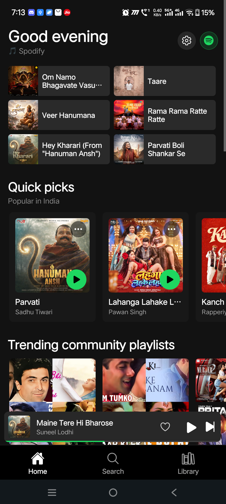 | 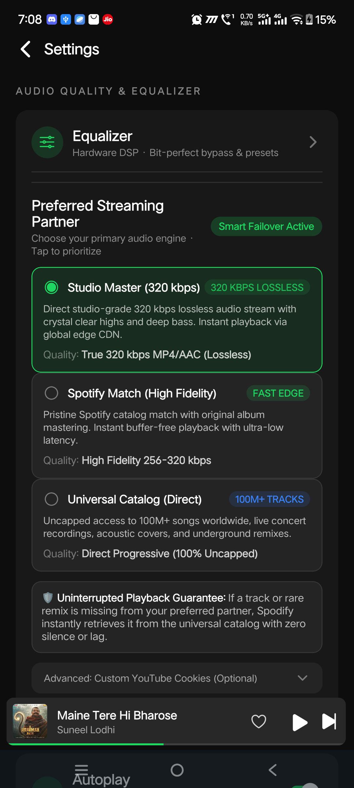 | 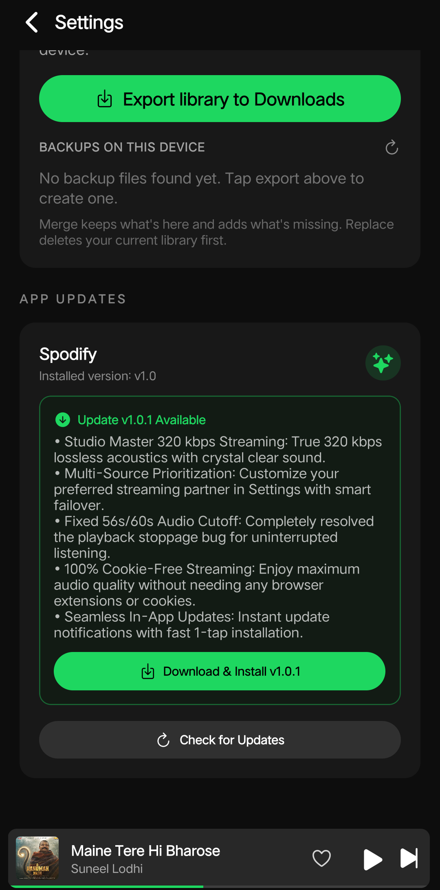 |  |

| 🎤 Synchronized Lyrics | 🎚️ 10-Band Hardware DSP | 🌊 60 FPS Visualizer | 📋 Dynamic Queue |
| :---: | :---: | :---: | :---: |
| 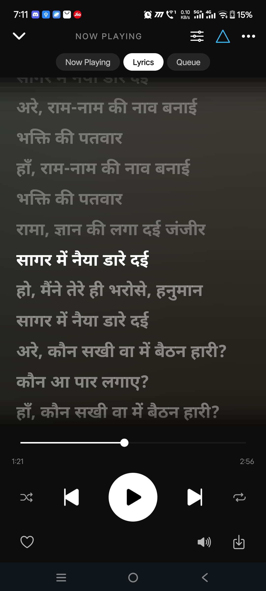 | 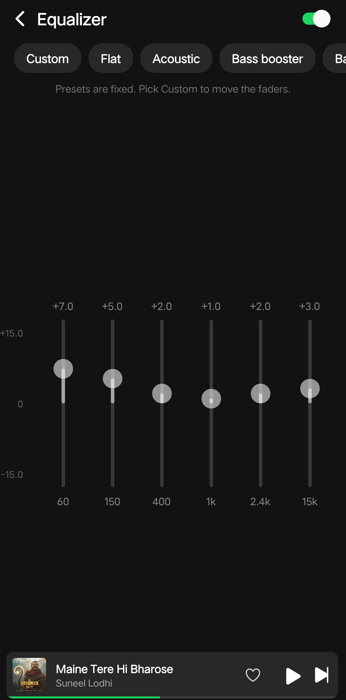 | 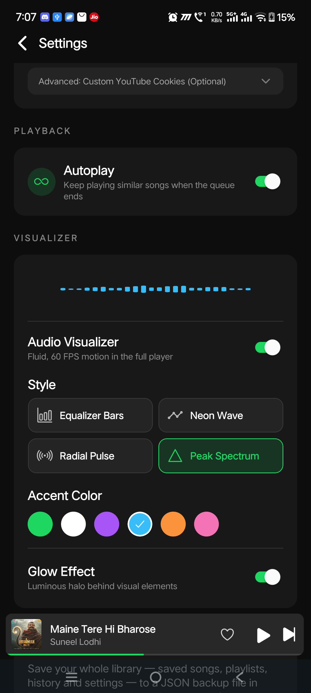 | 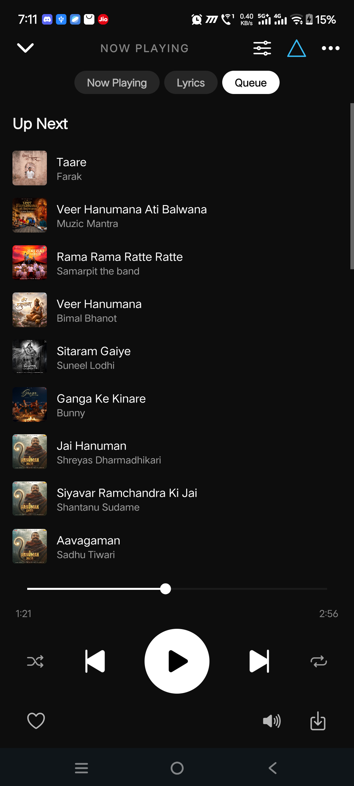 |

| 🔍 Universal Search | 🔄 Spotify Sync & Import | 📚 Your Library | 💾 Permanent Downloads |
| :---: | :---: | :---: | :---: |
| 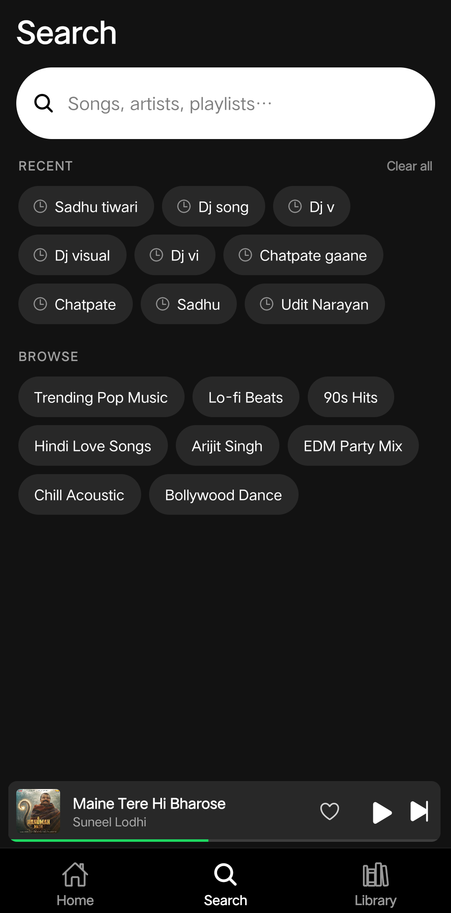 | 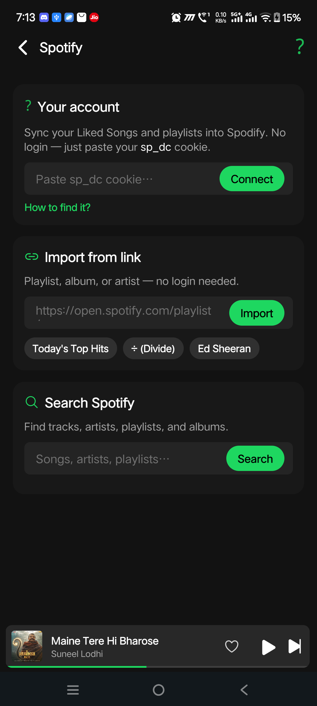 | 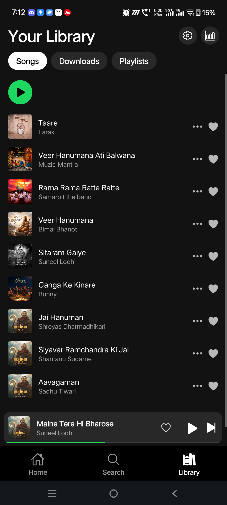 | 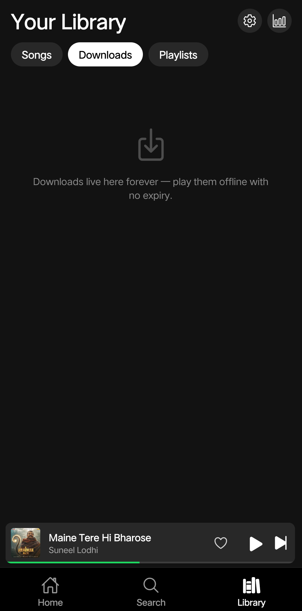 |

---

## 🚀 Complete Feature Breakdown

### 1. 🎧 Studio Master Streaming & Multi-Partner Engine
- **User-Selectable Engine**: Configure your prioritized streaming source under **Settings → Preferred Streaming Partner**:
  - **Studio Master (320 kbps)**: Highest fidelity progressive stream. Delivers rich dynamic range, uncompressed acoustic depth, punchy sub-bass, and crystal-clear high frequencies.
  - **Spotify Match**: 1:1 catalog matching based directly on Spotify track metadata, bypassing trackers and regional restrictions.
  - **Universal Catalog**: Maximum catalog coverage with 100M+ songs, covers, regional music, and live performances.
- **Smart Failover Guarantee**: If a mirror encounters network latency, slow CDN response, or a missing regional track, Spodify's engine transparently fails over to the next mirror within milliseconds. You will never experience a stalled buffer or silence.
- **Permanent 56s/60s Cutoff Resolution**: Progressive chunk streaming engine eliminates playback stalls and timeout issues completely.
- **100% Zero-Cookie Architecture**: No browser extensions, no cookie exports, and no expiring tokens. High-bitrate streaming works out of the box.

### 2. 📍 Zero-Tracking Location-Based Feed Suggestions
- **Smart On-Device Regional Feed**: The Home feed automatically displays trending music, national charts, and regional shelves (e.g. *India's Biggest Hits*, *Punjabi Hits*, *Bollywood Trending*) matching your country.
- **100% Private**: Resolved cleanly on-device without GPS permissions, without location tracking, and without third-party geo-IP APIs.

### 3. 📻 Spodify Radio, Smart Autoplay & Endless Listening
- **Spodify Radio**: A block on Home that builds a queue from your own listening history, then keeps refilling it as it plays, so the radio never runs out mid-song.
- **Tune It**: Narrow the radio with a language, a mood, an era, or how much of it should be new versus familiar. Every setting is optional, and leaving them all alone still works.
- **Blocklist**: Any artist you never want to hear again is blocked from its own screen, with search, a filter and paging, so the list can grow with you.
- **Continuous Listening**: When your active playlist, album, or queue reaches the end, Spodify dynamically seeds acoustically similar tracks and keeps the music playing smoothly.
- **User Configurable**: Toggle Autoplay on or off anytime in Settings according to your personal preference.

### 4. 🎤 Synchronized Karaoke Lyrics with Intelligent Fallbacks
- **Millisecond-Accurate Dynamic Tracking**: Real-time karaoke lyrics scroll dynamically with vocal phrasing and high-visibility active line highlighting.
- **Interactive Tap-to-Seek**: Tap any lyric line in the window to instantly jump audio playback to that exact timestamp.
- **Smart Drift Detection & Multi-Tier Fallbacks**:
  - Validates track runtime against lyric timestamps (±4s). If an audio edit (like a live version or sped-up remix) drifts, Spodify automatically switches to a clean scrollable lyric sheet instead of faking misaligned karaoke animations.
  - Multi-tier provider search with secondary lyrics sources.
  - Graceful clean notice with one-tap retry if no lyrics exist for rare indie tracks.
- **Offline SQLite Lyric Caching**: Fetched lyrics are saved locally for instant retrieval on repeat listens.

### 5. 🎚️ 10-Band Hardware DSP Equalizer
- **Direct Hardware Signal Processing**: Connects directly to Android's low-level audio output engine for latency-free real-time acoustic shaping.
- **10 Discrete Frequency Bands**: Fine-tune specific frequencies from deep sub-bass to air harmonics:
  `31 Hz` • `62 Hz` • `125 Hz` • `250 Hz` • `500 Hz` • `1 kHz` • `2 kHz` • `4 kHz` • `8 kHz` • `16 kHz` with ±12 dB precision control.
- **Bit-Perfect Audiophile Bypass Switch**: Enable pure direct output to disable all DSP processing and hear the untouched studio master recording.
- **Acoustic Presets**: Quick-switch presets for **Flat (Bit-Perfect)**, **Bass Booster**, **Acoustic**, **Vocal Enhancer**, and **Custom**.

### 6. 📱 Lockscreen & Notification Media System
- **Direct Lockscreen & Notification Heart Action**: Like or unlike the currently playing track straight from your Android notification shade or lockscreen without unlocking your phone or opening the app.
- **Android 13+ MediaStyle Support**: Complete with an interactive seekbar, high-resolution artwork, and responsive playback controls.
- **Uninterrupted Background Playback**: Employs network wake locks (`C.WAKE_MODE_NETWORK`) so music never drops when your screen turns off or your phone enters deep sleep.
- **Headphone & Bluetooth Smart Pause**: Automatically pauses music when headphones are disconnected or Bluetooth shuts off.
- **Clean Pause-on-Kill**: Swiping the app out of Android Recent Tasks cleanly stops playback instead of lingering in the background.

### 7. 🌊 60 FPS Real-Time Audio Visualizer
- **Fluid Waveform Synthesis**: Renders smooth audio visualizers directly above playback controls with zero frame drops.
- **4 Visual Styles**: Equalizer Bars, Neon Waveform, Radial Pulse, and Peak Spectrum.
- **Custom Glow Themes**: Choose from Spotify Neon Green, Cyberpunk Amber, Electric Violet, or Neon Cyan.

### 8. 🌙 Built-in Sleep Timer
- **Bedtime Listening**: Set a sleep timer (`5`, `10`, `15`, `30`, or `60` minutes) directly from the player's 3-dots menu.
- **Smooth Fade**: Playback pauses cleanly when the timer expires to protect your battery and sleep.

### 9. 📦 1-Tap Collection Bulk Actions
- **Bulk Download**: Download every song in any album or playlist with a single tap for offline listening.
- **Bulk Save to Library**: Bookmark entire collections into your personal library instantly.

### 10. 🔄 Spotify Sync & Direct URL Importer
- **1-Tap URL Importer**: Paste any public Spotify playlist, track, or album link (`open.spotify.com/...`) to instantly resolve and match all songs with lossless audio.
- **Account Sync**: Sync your public or private Spotify playlists and liked tracks without requiring Spotify Premium credentials or developer keys.

### 11. 💾 Permanent Offline Downloads & JSON Library Backup
- **Zero Expiration**: Downloaded tracks are stored locally on your device with no expiration locks or periodic online check-in requirements.
- **Embedded Metadata & High-Res Art**: Downloads automatically embed ID3 tags, artist names, album titles, and high-resolution album covers.
- **JSON Library Backup & Restore**: Export and import your entire library (playlists, liked tracks, custom order) as a single portable `.json` file across devices.

### 12. 📲 In-App Auto-Updater
- **Instant Version Discovery**: Automatically checks for new updates on launch using decentralized fallbacks.
- **In-App Changelog Dialog**: Read detailed release notes and feature improvements before deciding to update.
- **1-Tap Direct Install**: Downloads the verified APK package directly within the app and triggers the native Android package installer. No Play Store or third-party stores needed.

---

## 🔒 Why is the Source Repository Private?

We believe in radical transparency with our community. The core codebase is currently hosted in a private repository for two critical reasons:

1. **Protecting Against Resellers & Predatory Rebranders:**  
   In the open-source audio community, bad actors frequently scrape free projects, remove the original developer's credits, slap ads on the code, and attempt to sell the APKs. Spodify was created for the community as a passion project and is **100% free forever** — keeping the core private ensures no scammer profits off our work.

2. **Long-Term Service Reliability & Infrastructure Stability:**  
   Exposing media routing pipelines, stream bypass techniques, and content delivery endpoints publicly invites scraper abuse, automated spam, and aggressive service provider lockouts. Maintaining the repository privately ensures Spodify stays fast, uninterrupted, and reliably functioning for all users over the long term.

> 🛠️ **Maintenance & Future:**  
> Spodify is actively maintained and updated by the developer. If future conditions allow for safe open-sourcing without risking community abuse or service takedowns, making the repository public will gladly be revisited.

---

## ⚠️ 100% Free Policy & Scam Warning

> ### 🛑 **NEVER PAY ANYONE FOR THIS APP!**
> **Spodify is completely free.**  
> If anyone attempts to sell you this app, charge for APK access, or ask for money/donations claiming to be associated with Spodify, **it is a scam**. Report them immediately.

---

## 🛡️ Security & VirusTotal Verification

Every official APK release is compiled from a clean source environment and scanned for security.

| Parameter | Details |
| :--- | :--- |
| **Package Name** | `com.spodify` |
| **Release File** | `spodify-release.apk` |
| **Version** | `v1.1.0` (Build 5) |
| **Target Architecture** | Universal Android (ARM64, ARMv7, x86_64) |
| **Minimum Android** | Android 8.0+ (Oreo) |
| **SHA-256 Checksum** | `d5481e376672d8d01754d259f78c1decc9d26a9b533cd87401aa27cff56aef2a` |
| **VirusTotal Report** | [🔍 View VirusTotal Scan Results](https://www.virustotal.com/gui/file/d5481e376672d8d01754d259f78c1decc9d26a9b533cd87401aa27cff56aef2a) |
| **Detection Ratio** | `0` malicious, `0` suspicious across 75 engines (scanned 2026-10-06) |

### Checksum Verification
You can verify the integrity of the downloaded APK file in your terminal:
```bash
# Linux / macOS
sha256sum spodify-release.apk

# Windows PowerShell
Get-FileHash spodify-release.apk -Algorithm SHA256
```

---

## 🕵️ Privacy & Transparency

- **No Third-Party Analytics**: No analytics SDKs, no ad trackers, no session recording, no user profiling. Usage statistics go to the developer's own endpoint, never to a third party.
- **No Account Required**: Start listening immediately with zero login screens or email requirements.
- **Anonymous Usage Statistics (optional, can be turned off)**: To know how many people actually use Spodify and which crashes to fix, the app sends one anonymous report per session. It contains a random install ID, the app version, device model, Android version, chipset, and how long the session lasted and had audio playing. It contains **no** account, no name, no email, no advertising ID, no device serial, no location, no listening history, and no IP address. Country is derived from the connection at the endpoint and the IP itself is never stored. Turn it off any time in **Settings → Privacy**, and nothing is sent at all — including crash reports.
- **No Exploits**: Operates cleanly on-device utilizing public media standards. All settings and playlists remain entirely on your own device.

---

## 🐛 Bug Reports & Feature Requests

Encountered an issue or have an idea to make Spodify even better?  
Open a ticket on our official **[GitHub Issues](https://github.com/xauravww/spodify-releases/issues)** tracker!

When reporting an issue, please include:
- Your device model & Android version
- The song or action that triggered the issue
- Steps to reproduce

---

<p align="center">
  <b>Spodify</b> — Made with ❤️ for music enthusiasts everywhere.
</p>
